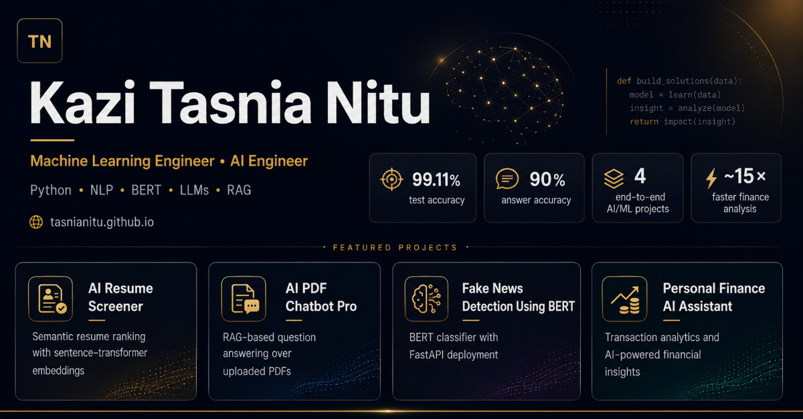

# Kazi Tasnia Nitu — AI/ML Portfolio

[](https://tasnianitu.github.io)


A responsive one-page portfolio presenting my selected machine learning, natural-language processing, large-language-model, and Retrieval-Augmented Generation projects.

<p align="center">
  <a href="https://tasnianitu.github.io">
    
  </a>
</p>

## Live Portfolio

**Website:** [tasnianitu.github.io](https://tasnianitu.github.io)

## About

I am a Computer Science and Engineering graduate specializing in Artificial Intelligence, focused on building practical machine learning and generative AI applications.

My work includes semantic resume matching, BERT-based text classification, Retrieval-Augmented Generation over PDF documents, and AI-powered financial analytics.

I am currently seeking entry-level opportunities as a **Machine Learning Engineer**, **AI Engineer**, or **Applied AI Engineer**.

## Featured Projects

### AI Resume Screener

Ranks multiple PDF resumes against a job description using sentence-transformer embeddings and cosine similarity.

- [Live Demo](https://tasnianitu-resume-screener.streamlit.app/#ai-resume-screener)
- [GitHub Repository](https://github.com/TasniaNitu/resume-screener)

### AI PDF Chatbot Pro

A local Retrieval-Augmented Generation application that answers questions about uploaded PDF documents using LangChain, FAISS, Hugging Face embeddings, and Ollama.

- [GitHub Repository](https://github.com/TasniaNitu/ai-pdf-chatbot-pro)

### Fake News Classifier

Classifies news articles as real or fake using a fine-tuned BERT model, with inference provided through a FastAPI REST API.

- [GitHub Repository](https://github.com/TasniaNitu/fake-news-classifier)
- [Hugging Face Model](https://huggingface.co/TasniaNitu/fake-news-bert)

### Finance AI Assistant

Processes bank-statement CSV files, categorizes transactions, generates interactive financial dashboards, and answers natural-language questions about spending.

- [GitHub Repository](https://github.com/TasniaNitu/finance-ai-assistant)

## Website Features

- Responsive one-page layout
- Clear professional headline
- About and career-focus section
- Four featured AI/ML projects
- Live project and repository links
- Technical-skills section
- Direct contact links
- Search-engine metadata
- Open Graph and Twitter/X social-preview metadata
- Accessible semantic HTML structure

## Website Technology

- HTML5
- CSS3
- Responsive CSS Grid and Flexbox
- GitHub Pages

## AI/ML Technologies Showcased

- Python
- Machine Learning
- Natural Language Processing
- PyTorch
- Hugging Face Transformers
- BERT
- Large Language Models
- Retrieval-Augmented Generation
- LangChain
- FAISS
- FastAPI
- Streamlit
- Ollama

## Repository Structure

```text
TasniaNitu.github.io/
├── README.md
├── index.html
├── styles.css
└── portfolio-preview.png
```

## Run Locally

Clone the repository:

```bash
git clone https://github.com/TasniaNitu/TasniaNitu.github.io.git
cd TasniaNitu.github.io
```

Open `index.html` directly in a browser, or start a local server:

```bash
python -m http.server 8000
```

Then open:

```text
http://localhost:8000
```

## Deployment

The portfolio is deployed through **GitHub Pages** from the `main` branch.

Any committed changes to `index.html`, `styles.css`, or the supporting assets are published through the configured GitHub Pages deployment.

## Contact

- **Email:** [kazitasnia20@gmail.com](mailto:kazitasnia20@gmail.com)
- **LinkedIn:** [linkedin.com/in/tasnia-ai](https://www.linkedin.com/in/tasnia-ai)
- **GitHub:** [github.com/TasniaNitu](https://github.com/TasniaNitu)
- **Portfolio:** [tasnianitu.github.io](https://tasnianitu.github.io)
